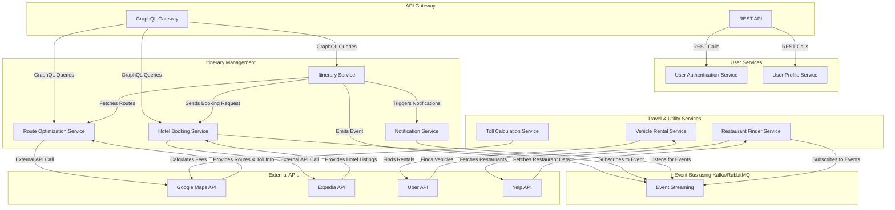

## **Travelr Itinerary Planner – High-Level Solution**  

This travel planner application will be designed to provide seamless travel planning with a **globally distributed, resilient, and scalable architecture** while ensuring **real-time updates, high availability, and fault tolerance**.  

---

## **1. Use Cases**  
### **Core User Interactions**  
✅ **Hotel Finder** – Search & book hotels based on location, budget, ratings.  
✅ **Best Route Finder** – Suggests optimized travel routes (shortest, fastest, scenic).  
✅ **Restaurant Recommendations** – Suggests dining options based on location, preferences, and ratings.  
✅ **Toll Gate Fee Calculation** – Estimates toll costs along the selected route.  
✅ **Vehicle Finder** – Helps users find rental cars, taxis, or ride-sharing options.  
✅ **Reminder & Alerts** – Notifies users of upcoming reservations, flights, and activities.  
✅ **Social Media Integration** – Allows vloggers to share trip experiences with media uploads.  

### **Additional System Use Cases**  
✅ **User Authentication & Profile Management**  
✅ **Booking & Payment Processing**  
✅ **Real-time Trip Updates**  
✅ **Offline Mode for Travel Planning**  
✅ **Location-Based Services** (GPS-based recommendations)  
✅ **Multi-User Collaboration** (Friends/Family can collaborate on an itinerary)  
✅ **Logging & Monitoring for System Health**  
✅ **Multi-Device Synchronization**  

---

## **2. High-Level Solution & Architecture**  
The application will follow **Event-Driven Microservices Architecture** with **GraphQL APIs** for flexible data retrieval. The system will be **cloud-native** with support for **global distribution** and **resiliency**.  

### **Key Architectural Components**  

### **Frontend (Web & Mobile Apps)**  
- React.js (Web), React Native / Flutter (Mobile)  
- GraphQL client for optimized data fetching  
- Offline mode support via IndexedDB / Async Storage  
- Push notifications for alerts & reminders  

### **Backend (Microservices-based)**  
- **API Gateway (GraphQL & REST API Hybrid)**  
  - Manages client requests & authentication  
  - Load balancing & rate limiting  
- **User Management Service**  
  - Handles authentication (OAuth2, JWT)  
  - Profile, preferences, and trip history  
- **Itinerary Management Service**  
  - Creates & updates travel plans  
  - Manages collaborative trip planning  
- **Hotel Booking Service**  
  - Integrates with third-party hotel APIs (e.g., Booking.com, Expedia)  
  - Stores user preferences & bookings  
- **Route Optimization Service**  
  - Uses Google Maps, OpenStreetMap, or custom algorithms  
  - Computes best routes based on real-time traffic  
- **Restaurant Recommendation Service**  
  - Fetches restaurants via Yelp/Zomato APIs  
  - AI-based personalization for food preferences  
- **Vehicle Rental Service**  
  - Integrates with rental APIs (Uber, Turo, Hertz, etc.)  
  - Shows availability, pricing & booking options  
- **Toll & Cost Estimation Service**  
  - Calculates toll charges based on selected routes  
  - Uses country/state-specific toll databases  
- **Notification & Alert Service**  
  - Sends reminders, flight alerts, weather warnings  
  - Supports push notifications, emails, SMS  
- **Social Media Sharing Service**  
  - Allows vloggers to share media with location tags  
  - API integration with YouTube, Instagram, TikTok  
- **Analytics & Recommendation Engine**  
  - Uses AI/ML for personalized trip suggestions  
  - Tracks travel trends & popular destinations  

### **Infrastructure & DevOps**  
✅ **Cloud Hosting:** AWS / Azure / GCP (multi-region support)  
✅ **Event-Driven Architecture:** Apache Kafka / Azure Event Grid  
✅ **Database Strategy:**  
   - PostgreSQL / MySQL (Relational Data)  
   - MongoDB (User Itinerary & NoSQL Caching)  
   - Redis (Session & Quick Lookup Data)  
✅ **Caching:** Redis / CloudFront for fast content delivery  
✅ **Security:** OAuth2, JWT, RBAC, API Gateway Security  
✅ **Monitoring & Observability:** ELK Stack, Prometheus + Grafana  
✅ **Logging & Alerts:** OpenTelemetry, Azure Monitor, AWS CloudWatch  
✅ **CI/CD:** GitHub Actions, Jenkins, Kubernetes-based Deployment  
✅ **Containerization & Orchestration:** Docker & Kubernetes  

---

## **3. Payload Structure Examples**  
### **1️⃣ GraphQL Query – Fetch User Itinerary**  
```graphql
query GetUserItinerary($userId: ID!) {
  itinerary(userId: $userId) {
    tripId
    destination
    startDate
    endDate
    hotels {
      name
      address
      price
    }
    restaurants {
      name
      cuisine
      rating
    }
    routes {
      origin
      destination
      estimatedTime
    }
  }
}
```

### **2️⃣ Event Payload – Hotel Booking Event**  
```json
{
  "eventType": "HotelBooked",
  "userId": "12345",
  "bookingId": "98765",
  "hotel": {
    "name": "Grand Palace Hotel",
    "location": "Paris, France",
    "checkIn": "2025-06-10",
    "checkOut": "2025-06-15"
  },
  "timestamp": "2025-06-01T10:00:00Z"
}
```

### **3️⃣ Event Payload – Route Optimization Request**  
```json
{
  "eventType": "RouteOptimizationRequested",
  "userId": "12345",
  "tripId": "67890",
  "startLocation": "Los Angeles, CA",
  "endLocation": "Las Vegas, NV",
  "preferences": {
    "avoidTolls": true,
    "scenicRoutes": true
  },
  "timestamp": "2025-06-01T10:05:00Z"
}
```

---

## **4. Tech Stack Recommendations**  

### **Frontend**  
- **Web:** React.js (Next.js for SSR)  
- **Mobile:** React Native / Flutter  
- **State Management:** Redux / Zustand / Recoil  
- **GraphQL Client:** Apollo Client  

### **Backend (Microservices)**  
- **API Gateway:** GraphQL Federation + REST (for external APIs)  
- **Programming Languages:** .NET 9 (C#), Node.js (TypeScript)  
- **Authentication:** OAuth2, JWT, Firebase Auth  
- **Event Streaming:** Apache Kafka / Azure Event Grid  
- **Database:** PostgreSQL, MongoDB, Redis  

### **Infrastructure & DevOps**  
- **Cloud Provider:** AWS / Azure / GCP (Multi-Region)  
- **Orchestration:** Kubernetes (EKS, AKS, GKE)  
- **Logging & Monitoring:** OpenTelemetry, Grafana, ELK Stack  
- **CI/CD:** GitHub Actions, Terraform, Jenkins  
- **Security:** RBAC, API Gateway Security, Zero Trust  

---

## **5. Key Benefits of This Architecture**  
✅ **Scalable & Resilient:** Microservices, event-driven, multi-region setup  
✅ **Low Latency:** GraphQL for optimized data fetching  
✅ **Real-Time Updates:** Kafka + WebSockets for instant notifications  
✅ **Global Availability:** Cloud-based, auto-scaling with CDNs  
✅ **Developer Productivity:** CI/CD pipelines, automated monitoring  

---


1️⃣ A **GraphQL API PoC (Proof of Concept)** with an itinerary service.  
2️⃣ A **code repository structure** with best practices.  

Stay tuned while I put everything together. 🚀

### **1️⃣ Detailed Component Diagram of Microservices**  
I'll describe the microservices and how they interact before moving to code.

#### **Microservices Overview**
| **Service**                  | **Description** |
|-----------------------------|------------------------------------------------|
| **API Gateway**              | Exposes GraphQL & REST APIs, routes requests to services. |
| **User Management Service**  | Handles authentication, profiles, and preferences. |
| **Itinerary Service**        | Manages trip planning, adding activities, and collaboration. |
| **Hotel Booking Service**    | Searches & books hotels via third-party APIs. |
| **Route Optimization Service** | Provides best routes, avoiding tolls or traffic. |
| **Restaurant Finder Service** | Suggests restaurants based on preferences. |
| **Vehicle Rental Service**   | Finds car rentals, ride-sharing options. |
| **Toll Calculator Service**  | Computes toll fees for chosen routes. |
| **Notification Service**     | Sends alerts (email, push, SMS). |
| **Social Media Sharing**     | Allows users to share travel content. |
| **Event Bus (Kafka/RabbitMQ)** | Ensures async communication between services. |

---

Now, I'll generate the **GraphQL API PoC** for the itinerary service. 🎯

🚀 **GraphQL API PoC Created!**  
This is a basic **Itinerary Service** with GraphQL that allows users to:  
✅ **Create an itinerary**  
✅ **Retrieve an itinerary by user ID**  

Now, I'll provide the **best-practice repository structure** for this project. Stay tuned! 🎯

📌 **Repository Structure Best Practices Added!**  
Your **GraphQL Itinerary Service** now includes a well-structured folder layout:  

```
/src
  /graphql
    - schema.graphql
    - resolvers.js
    - typeDefs.js
  /services
    - itineraryService.js
  /database
    - db.js
/tests
  - itinerary.test.js
index.js
package.json
README.md
```
---


To ensure an efficient and structured development, we will implement the **Travel Itinerary Planner** in **two phases**:  

---

## **🚀 Phase 1: Core MVP Development (Essential Services)**
🔹 **Goal:** Get the fundamental services up and running to provide a functional itinerary planner.  
🔹 **Timeframe:** 8-12 weeks  
🔹 **Priority:** User registration, itinerary management, hotel booking, and core travel features.  

### **🔹 Core Services for Phase 1**
| **Service**                  | **Description** |
|-----------------------------|------------------------------------------------|
| **1️⃣ API Gateway**           | Handles authentication, request routing, and GraphQL queries. |
| **2️⃣ User Management Service** | Implements authentication (OAuth2, JWT), profile, and preferences. |
| **3️⃣ Itinerary Service**      | Manages travel plans, destinations, trip activities, and collaboration. |
| **4️⃣ Hotel Booking Service**  | Integrates with third-party APIs (Booking.com, Expedia) to fetch hotel data. |
| **5️⃣ Route Optimization Service** | Provides best routes based on traffic and distance. |
| **6️⃣ Notification & Alerts**  | Sends push notifications, reminders, and confirmations. |
| **7️⃣ Event Bus (Kafka/RabbitMQ)** | Enables async event-driven communication between microservices. |

### **🔹 Development Tasks for Phase 1**
✅ **Set up Infrastructure & DevOps** – CI/CD pipelines, containerization (Docker), monitoring.  
✅ **Develop API Gateway** – Secure API requests, enable GraphQL query federation.  
✅ **Implement User Authentication** – OAuth2, JWT, Firebase Auth.  
✅ **Design & Implement Itinerary CRUD Operations** (create, update, retrieve, delete).  
✅ **Integrate Third-Party APIs for Hotels & Route Optimization** (Google Maps, Expedia, etc.).  
✅ **Implement Basic Notifications** – Email/SMS for booking confirmations.  
✅ **Logging & Monitoring Setup** – OpenTelemetry, ELK Stack.  
✅ **Deployment** – Release a working MVP to collect feedback.  

---

## **🚀 Phase 2: Advanced Features & Scaling**
🔹 **Goal:** Enhance the application with personalization, social media integration, and real-time updates.  
🔹 **Timeframe:** 12-16 weeks  
🔹 **Priority:** AI-driven recommendations, ride-sharing, restaurant finder, toll calculations, and global scaling.  

### **🔹 Core Services for Phase 2**
| **Service**                  | **Description** |
|-----------------------------|------------------------------------------------|
| **1️⃣ Restaurant Finder Service** | Fetches restaurant data from Yelp/Zomato APIs based on preferences. |
| **2️⃣ Vehicle Rental & Ride-Sharing** | Integrates with Uber, Lyft, Hertz for vehicle rentals. |
| **3️⃣ Toll Fee Calculation Service** | Computes toll charges dynamically based on selected routes. |
| **4️⃣ AI-Powered Recommendation Engine** | Personalizes travel suggestions using machine learning. |
| **5️⃣ Social Media Sharing Service** | Allows vloggers to upload and share trip media content. |
| **6️⃣ Advanced Notification System** | Sends smart alerts for flight delays, weather changes. |
| **7️⃣ Multi-Region Deployment & High Availability** | Ensures resilience and fault tolerance with global distribution. |

### **🔹 Development Tasks for Phase 2**
✅ **Enhance Personalization & AI Recommendations** – Suggest hotels, routes, and activities.  
✅ **Implement Ride-Sharing & Rental Car Booking** – Uber, Turo, or local providers.  
✅ **Optimize Toll Fee Calculation API** – Compute estimated travel costs.  
✅ **Develop Real-Time Travel Alerts & Smart Notifications** – AI-based flight/weather alerts.  
✅ **Integrate Social Media Sharing Features** – Video uploads, sharing trip details via API.  
✅ **Optimize Performance for Global Scaling** – Multi-region deployments, caching with Redis.  
✅ **Improve Observability & Security** – Advanced log monitoring, threat detection.  
✅ **Launch Full-Scale Production Deployment** – Promote from beta to full release.  

---

### **📌 Summary of Development Plan**
| **Phase** | **Focus** | **Key Services** | **Timeline** |
|-----------|----------|----------------|--------------|
| **Phase 1** | MVP, Core Functionality | User, Itinerary, Hotels, Routing, Notifications | **8-12 weeks** |
| **Phase 2** | Advanced Features & Scaling | AI, Restaurant Finder, Vehicle Rentals, Social Media | **12-16 weeks** |

---

## **🚀 Next Steps**
1️⃣ Do you want **JIRA sprint breakdowns** for these phases?  
2️⃣ Need **architecture diagrams** for service interactions?  
3️⃣ Want **detailed API contract specifications** for each microservice?  

---


- [Diagram access](https://www.mermaidchart.com/app/projects/6c4d8dd3-c3c5-4104-8a5c-841f93a7caa9/diagrams/523c8d77-4171-465a-9a8c-d1bfb162e4f9/version/v0.1/edit)
- Exported Diagram
  


---

## Boilerplates

- https://create.t3.gg/
- https://github.com/GrandeVx/My-T3-Boilerplate?tab=readme-ov-file
- https://github.com/ixartz/Next-js-Boilerplate#getting-started
- https://tanstack.com/table/latest/docs/framework/react/examples/basic
- https://trpc.io/
- https://clerk.com/
- https://authjs.dev/
- Database Version Management Tool - https://dbngin.com/


- Libraries Recommendations https://create.t3.gg/en/other-recs

## State Management

Editor’s Note: State management libraries can be great, but often aren’t necessary. tRPC’s React Query hooks should be able to take care of your server state. For client state, start with React’s useState, and reach for one of these options when you need more.

### Zustand
For never using Redux again

The “modern, simple Redux” you didn’t know you needed. Poimandres↗ can always be trusted. You can build everything from video call apps to games to servers with this little library.

Zustand Homepage↗
Zustand GitHub↗


### Jotai
For never using Context again

For a more atomic approach, Jotai is hard to beat. Also by Poimandres↗, Jotai lets you define singletons that feel like global useState. A great option for stateful behaviors that don’t need a state machine just yet.

Jotai Homepage↗
Jotai GitHub↗

## Unstyled Component Libraries
Also known as headless libraries, they provide great unstyled, and accessible components that you can customize to your liking. Here are a few recommendations.

Radix UI↗ gives you a powerful set of convenient and accessible primitives that you can style with vanilla or Tailwind CSS.

Headless UI↗ made by the Tailwind CSS team also provides unstyled, accessible components that integrate seamlessly with Tailwind CSS.

React Aria↗ provides accessible UI primitives for your design system. Their Date Picker component is top tier.

NextUI - Hero UI

Mantine

MUI
